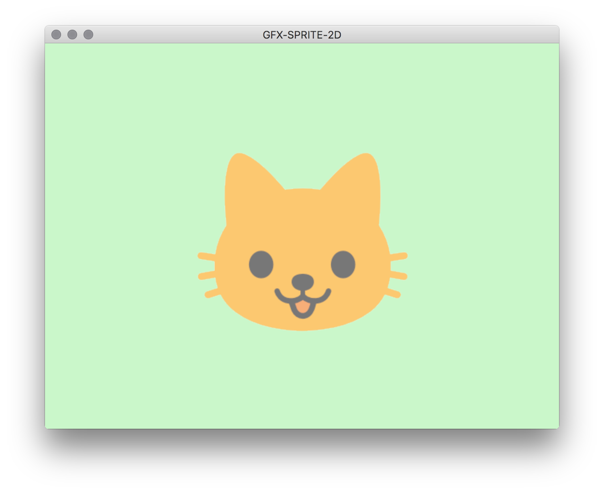

# GFX-SPRITE-2D

This is a basic example of a rendering a png with alpha transparency using [GFX](https://github.com/gfx-rs/gfx), [glutin](https://github.com/tomaka/glutin), [cgmath](https://github.com/brendanzab/cgmath), and [image](https://github.com/PistonDevelopers/image).

This is my first step in learning GFX and trying to document my process, so please let me know if there is anything that is correct or could be done better.

A lot of my learning is based around reading the [examples](https://github.com/gfx-rs/gfx/tree/master/examples) in the main GFX repo, which I highly recommend when learning GFX.

Thank you for looking!

The cat emoji used as an image is part of Google's [noto-emoji](https://github.com/googlei18n/noto-emoji) project and is licensed under [Apache 2.0](https://github.com/googlei18n/noto-emoji/blob/master/LICENSE).
